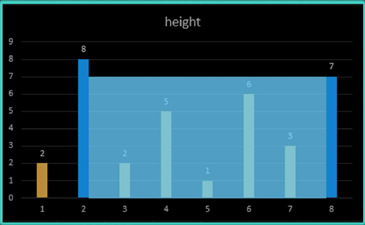

# Day 5 - Problem Description

## Difficulty: Easy

You are given a list of integers of length n named _height_. Now imagine that for each x=i (where i ranges from 1 to n) on the cartesian plane you draw a perpendicular line segment from y=0 to y=height[i]. Given two such segments l1 at position i1 and l2 at position i2, let the _admissible rectangle_ formed by l1 and l2 be the rectangle whose two perpendicular sides have lengths |i1-i2| and min(l1,l2) respectively. The task is to find the maximal area of an admissible rectangle formed by any two line segments given a particular height list.

For example, given the height input

> 2, 8, 2, 5, 1, 6, 3, 7,

the desired output is

> 42,

which is obtained by the following admissible rectangle:

