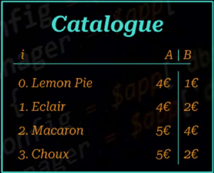

# Day 6 - Problem Description

## Difficulty: Easy/Medium

You are given two lists A and B, each of length N. For each i = 0,...,N-1, A[i] represents the price of sweet i, and B[i] represents the amount of money you will receive back if you buy sweet i. The task is to write an algorithm which receives a number E as well as the two lists A and B as input, and outputs the maximal number of sweets you can buy starting with E euros. Note that you only receive your money back **after** you have bought a sweet, not before or during the transaction.

For example, assume you are starting with E=10 and the following catalogue:

Then you can buy a maximum of 7 sweets. Indeed, you can first buy Macaron 6 times, paying 5 euros and getting back 4 euros with each transaction. Then you are left with 4 euros, with which you can either buy 1 Lemon Pie or 1 Eclair. Finally, after the last purchase you no longer have enough money to buy any more sweets.
