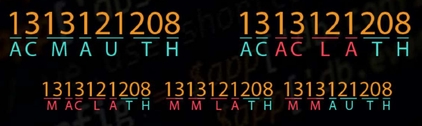

# Day 7 - Problem Description

## Difficulty: Hard

Suppose you are using a basic encryption algorithm which takes a capital letter of the alphabet and encodes it as the number corresponding to the letter's position in the English alphabet (i.e. A -> 1, B -> 2, ... , Z -> 26). So for example, the message

> ACMAUTH

would be encrypted as

> 1313121208.

Now suppose you want to decrypt the message 1313121208. According to how you group the numbers together, there might be multiple ways to do so:

The task is to write an algorithm which takes a sequence of numbers such as the above, and returns the number of all distinct messages that could be the message's decryption. For the above example, the output of the algorithm should be 12.

Note that e.g. only 1 and not 01 is a valid encryption of the letter A; that is, a decryption in which 01 is mapped to A would be invalid (and similarly for the rest of the letters which are encrypted as a single digit).
