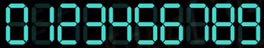
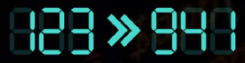

# Day 7 - Problem Description

## Difficulty: Easy/Medium

In order to represent a number in 7-segment, a certain number of segments is required:

The task is to write an algorithm which is given an integer n, an integer k and a digit m, and returns the maximal k-digit number which can be represented in 7-segment using at most as many segments as those used in the representation of n, while also avoiding the digit m.

For example if n=123, k=3 and m=7, then the output of the algorithm should be the number 941, which is the maximal 3-digit number not containing the digit 7 which can be written with at most (in fact exactly) 12 segments.

